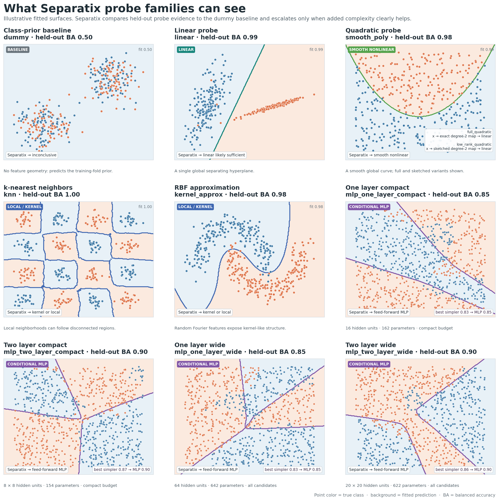
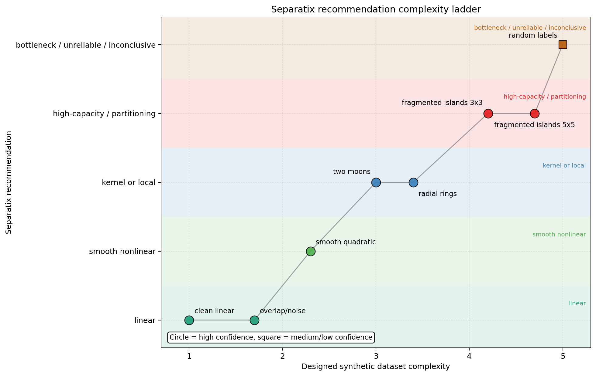

[](https://github.com/NiklasMelton/Separatix)

# Separatix

`separatix` profiles labeled feature spaces before supervised model training
and returns transparent, confidence-aware guidance about apparent classification
or regression complexity.

The intended use case includes learned embeddings, but the package is not
restricted to embeddings. It also works on raw feature matrices when you want a
coarse diagnostic of whether the observed supervised geometry looks mostly
linear, smoothly nonlinear, local or kernel-like, fragmented or discontinuous,
bottlenecked, or too unreliable to trust.

`separatix` does not claim to pick the optimal classifier or regressor. It is a
pretraining diagnostic and auditing tool designed to make its reasoning visible.

## Installation

```bash
pip install separatix
```

To install the latest development version directly from GitHub:

```bash
pip install "git+https://github.com/NiklasMelton/Separatix.git@develop"
```

## Quick start

```python
from separatix import diagnose

recommendation = diagnose(X, y, random_state=0)
print(recommendation)
```

For a structured audit:

```python
from separatix import diagnose

report = diagnose(X, y, return_report=True, random_state=0)
print(report.recommendation_text)
print(report.decision_path)
print(report.scores)
print(report.to_json())
```

### Experimental protocol: diagnose twice

When a final test set is reserved, run Separatix at the two training sizes that
matter:

1. Run it on the selection cohort before choosing and tuning candidate model
   families against validation data.
2. After validation-based comparison and tuning are complete, combine the
   training and validation cohorts, rerun Separatix on that enlarged development
   cohort, and record the second report before fitting the final model.

The first report supports selection-time reasoning. The second records the
evidence on the enlarged final development cohort and may inform the final model
specification. Compare each report's `probe_evaluation.n_samples` and
`effective_train_size_summary` (checking `status` and `basis` before comparing
numeric fields) to explain what rows and fold-fit sizes supported the two runs;
these fields are descriptive metadata, not a claim about performance at other
training sizes. Neither run should receive test rows or test labels. Make every
remaining decision before evaluating the final fitted model once on the
untouched test set; that test is the independent assessment of the complete
procedure.

See the [two-stage experimental protocol](docs/quickstart.md#two-stage-experimental-protocol)
for an example and interpretation guidance.

## What It Accepts

- Dense NumPy arrays
- SciPy sparse matrices
- pandas DataFrames and Series when pandas is installed
- Binary and multiclass classification targets
- Multilabel binary indicator targets with `target_mode="multilabel"` or
  auto-detection for unambiguous 2D indicators
- Continuous single- or multi-target regression with explicit
  `target_mode="regression"`
- String or numeric labels treated as categorical class identifiers

Regression is opt-in so numeric class identifiers remain categorical by
default. General multioutput classification is not supported.

## What It Returns

By default, `diagnose(...)` returns a plain-text recommendation. With
`return_report=True`, it returns a `DiagnosticReport` that includes:

- the recommendation label
- plain-text recommendation text
- confidence level
- underlying metric groups
- probe-family evidence, including uncertainty-aware family comparisons
- normalized summary scores
- a visible decision path
- warnings and skipped diagnostics
- sampling and densification events
- preprocessing and runtime metadata

The report is JSON-serializable through `report.to_dict()` and `report.to_json()`.
Non-finite diagnostic values are represented as JSON `null`; `to_json()` never
emits non-standard `NaN` or infinity literals. The default terse form removes
large row-level arrays before copying them.

Constructed probe entries also include a compact, versioned `probe_recipe` for
auditing. It records the resolved estimator graph, preprocessing,
hyperparameters, training policy, and dynamically detected Python and library
versions. Reconstruct the corresponding unfitted estimator through the safe
public factory:

```python
from separatix import make_probe_estimator

recipe = report.metrics["probes"]["linear"]["probe_recipe"]
estimator = make_probe_estimator(recipe)
```

The factory only accepts a fixed allowlist of supported scikit-learn and
Separatix probe components; serialized recipes cannot request arbitrary imports.
Skipped probes report why a recipe is unavailable instead of implying that an
unconstructed estimator can be reproduced. The factory reconstructs the
unfitted estimator configuration; it does not replay the diagnostic's row
cohort, validation folds, or scoring orchestration. Those details remain
separate report evidence.

For multilabel targets, `separatix` compares probe families across micro F1,
macro F1, and sample Jaccard rather than collapsing the evidence into a single
weighted score. Optional iterative multilabel stratification can be installed
with:

```bash
pip install "separatix[multilabel]"
```

For regression targets, call `diagnose(X, y, target_mode="regression")`.
Regression evidence is compared across variance-weighted R2 and uniform-average
R2, with normalized RMSE and target-neighborhood smoothness as supporting
diagnostics. Classification-only boundary and fragmentation diagnostics are
marked not applicable and do not reduce regression confidence.

All non-dummy probe families learn feature scaling inside each validation
training fold. Sparse probes use non-centering scaling. Geometry and topology
continue to describe the supplied, unscaled coordinate space, and the report
records both choices under `preprocessing`.

Ordinary probe families are evaluated on one shared row cohort and one shared
held-out split plan. When aligned out-of-fold predictions are available, family
and dummy comparisons use paired bootstrap intervals; affected comparisons fall
back to marginal uncertainty when paired evidence is unavailable. The paired
intervals capture covariance between probe errors, but remain diagnostic
resampling evidence rather than independent-test confidence intervals.

Reports also expose effective fit-size metadata for these ordinary probes at
`report.metrics["probe_evaluation"]["effective_train_size_summary"]`. Its
`status` is `"available"` or `"unavailable"`; when available, `basis` is
`"held_out_folds"` or `"resubstitution"`. The `min`, `median`, `mean`, and
`max` fields summarize the rows used to fit the ordinary probe instances, and
`mean_fraction_of_evaluation_cohort` is the mean divided by
`report.metrics["probe_evaluation"]["n_samples"]`. That denominator is the
shared evaluation cohort *after* any memory-aware sampling or densification, not
necessarily the number of rows originally passed to `diagnose`. An unavailable
summary has `basis=None` in Python (JSON `null`) and `None` for every numeric
field (JSON `null`). This metadata covers ordinary probes only; optional MLP
probes are not included. It describes one evaluation run and is not a
learning-curve or training-size-sensitivity diagnostic.

Optional feed-forward MLP probes can be installed and enabled explicitly:

```bash
pip install "separatix[mlp]"
```

Set `mlp_probes=True` and use `mlp_device`, `mlp_trigger_skill_threshold`,
`mlp_min_improvement`, and `mlp_max_parameters` to control them. The skill
threshold is only a compute gate: it determines whether MLP probes run and does
not participate in a completed override decision. An MLP can override
simpler-family guidance only with complete held-out evidence, paired signal
above dummy, and a practical paired gain over the strongest simpler probe for
the required primary metrics. Failed or infeasible group splits never fall back
to in-sample override evidence.

MLP pairwise evidence uses one target-aware paired-bootstrap cache local to the
MLP cohort. The ordinary-probe cache cannot be reused literally because MLP
probes use their own capped, dense, aligned cohort. The local cache scores the
selected best MLP, the dummy baseline, and the metric-specific strongest
simpler comparator once, then retains only the comparisons needed for the
override. All required simpler comparators are still evaluated and remain
available under `report.metrics["mlp_probes"]["aligned_comparators"]`; pruning
the retained pairwise summaries does not weaken the completeness gate. This
optimization avoids repeated resampling and scoring, but MLP fitting remains
the dominant optional cost and the optimization should not be read as a
whole-diagnosis speed guarantee.

The MLP payload's `pairwise_comparison_audit` records the cache status and
resample plan. See [the report reference](docs/reports.md#optional-mlp-pairwise-audit)
for its exact fields and grouped/class-support behavior.

Optional persistent-topology diagnostics can be installed with:

```bash
pip install "separatix[tda]"
```

For multilabel targets, persistent topology is supporting evidence only. When
enabled, it is computed on capped boundary-candidate subsets and a small capped
set of high-support label-positive subsets.

For regression targets, optional topology is computed only on capped
high-residual and high-local-discontinuity subsets. `topology="graph"` uses a
sparse-compatible mutual-nearest-neighbor component summary;
`topology="persistent"` adds persistent homology when `ripser` is installed.
`topology="auto"` skips topology under the fast budget and otherwise attempts
both summaries. Regression topology is descriptive supporting evidence: it is
included in the report but never changes the recommendation label or confidence.

## Probe Family Gallery

`separatix` compares several deliberately small probe families rather than
treating one flexible model as a universal answer. The fitted surfaces below
illustrate the behavior each probe is intended to detect. The quadratic panel
includes both the full expansion and low-rank sketch variants. The final four
panels use four independently sampled and calibrated nonlinear tasks, one for
each optional conditional MLP subtype. Every named subtype is the selected
held-out candidate on its own task and produces a validated MLP override.

The displayed boundaries are illustrative fits. Recommendations use held-out
evidence, comparisons against the dummy baseline, uncertainty estimates, and a
conservative preference for simpler families. Two-dimensional single-label
classification is used here because its boundaries are easy to see. The MLP
tasks each add five nuisance coordinates to two visible signal coordinates;
their plots show fitted slices at the nuisance-coordinate medians. The compact
tasks apply a 400-parameter cap so depth is compared within the compact budget,
while the wide tasks compare all four candidates. These deterministic
calibrations are architecture exemplars, not claims that one architecture is
universally optimal. Multilabel and regression diagnostics use
target-appropriate versions of the same probe families and their corresponding
metrics.



Regenerate the gallery after installing the example dependencies:

```bash
poetry install -E examples -E mlp
poetry run python examples/probe_family_gallery.py
```

The script checks its coverage against the implemented probe registry and fails
if any calibrated task stops selecting its intended MLP subtype or stops
clearing the simpler probes. It also requires the selected subtype to lead the
next-best eligible MLP by at least 0.01 held-out balanced accuracy.

## Recommendation Categories

- `linear_likely_sufficient`
- `smooth_nonlinear_recommended`
- `kernel_or_local_recommended`
- `high_capacity_or_partitioning_recommended`
- `feedforward_mlp_recommended`
- `feature_or_label_bottleneck_likely`
- `insufficient_data_or_unreliable_geometry`
- `inconclusive`
- `linear_response_likely_sufficient`
- `smooth_nonlinear_response_recommended`
- `kernel_or_local_regression_recommended`
- `higher_capacity_or_partitioning_regression_recommended`
- `feedforward_mlp_regression_recommended`
- `feature_or_target_bottleneck_likely`
- `insufficient_data_or_unreliable_regression_geometry`
- `inconclusive_regression_diagnostic`

These categories are intentionally coarse. They describe the apparent geometry
and difficulty of the labeled feature space, not a guaranteed best model choice.

The synthetic recommendation ladder below shows how `separatix` responds as the
designed dataset geometry moves from simple linear structure toward smoother
nonlinearity, local or kernel-like structure, fragmented boundaries, and
finally weak-signal or random-label bottlenecks. The x-axis is the intended
dataset complexity, while the y-axis is the coarse recommendation level
reported by `separatix`.



## Decision Pipeline

The recommendation is produced by a fixed, inspectable pipeline:

1. Validate inputs and encode labels.
2. Audit class counts, imbalance, sparsity, and basic dataset conditions.
3. Compute geometry, neighborhood, boundary, fragmentation, and optional
   topology diagnostics, using a distinct multilabel path for binary indicator
   targets.
4. Run simple probe models and compare them to a dummy baseline.
5. Build probe-family evidence with uncertainty estimates for `linear`,
   `smooth_nonlinear`, and `local_kernel`.
6. Apply an uncertainty-aware signal-vs-dummy gate before making any
   model-family recommendation: balanced accuracy for single-label targets, two
   of three primary metrics for multilabel targets, or at least one of the two
   primary R2 summaries for regression. Use paired OOF evidence when available
   and the documented marginal-uncertainty fallback otherwise.
7. Use conservative escalation: keep the simpler family unless a more complex
   family has a clear uncertainty-adjusted advantage.
8. Treat fragmentation and optional topology as supporting structural evidence,
   not as shortcuts around weak probe evidence.
9. Render both a plain-language summary and a structured report, including
   `raw_best_family`, `recommended_family`, and an uncertainty-aware plausible
   core-family set when a report is requested.

The plausible set is a heuristic competitive frontier over the tested
`linear`, `smooth_nonlinear`, and `local_kernel` probes. It is not a formal
confidence set and does not claim that retained families perform equally well.
Optional MLP and high-capacity structural upgrades remain separate from this
core-family comparison.

The full rationale and decision rules are documented in
[the decision pipeline reference](docs/decision_pipeline.md).

## Sparse Inputs And Memory Behavior

Sparse matrices are accepted directly. Diagnostics that need dense data use a
shared densification policy rather than a separate dense-only code path. When a
step would require densification, `separatix` can fail, skip, or warn and
subsample before densifying, depending on configuration. These events are
recorded in the report.

`max_samples` and `max_dense_mb` are hard limits. Group-aware sampling never
splits a group or exceeds the row cap. If no support-preserving sample fits,
the affected supervised diagnostic is skipped and reliability is marked
insufficient instead of silently dropping classes or labels. The dense-memory
budget applies to sparse multilabel targets as well as feature matrices.

When `groups` are supplied, sampling keeps groups whole and predictive evidence
must come from group-disjoint held-out splits. Each evaluated class or label
side needs support in both training and test partitions. A single group, an
oversized group, or a class confined to too few groups therefore causes the
affected supervised evidence to be skipped instead of evaluated on its training
rows. Geometry and topology remain descriptive in those cases.

Numeric one-dimensional targets—including non-integral values—remain
categorical unless `target_mode="regression"` is explicit. High-cardinality
numeric classification targets produce a warning to make accidental routing
visible.

## Examples

- [Basic breast-cancer report](docs/examples.md#basic-breast-cancer-report)
- [Linear hyperplane visualization](docs/examples.md#linear-hyperplane-visualization)
- [Curvilinear boundary visualization](docs/examples.md#curvilinear-boundary-visualization)
- [High-dimensional linear hyperplane](docs/examples.md#high-dimensional-linear-hyperplane)
- [High-dimensional curvilinear hyperplane](docs/examples.md#high-dimensional-curvilinear-hyperplane)
- [Two moons](docs/examples.md#two-moons)
- [Kernel-like circles](docs/examples.md#kernel-like-circles)
- [Probe family gallery](docs/examples.md#probe-family-gallery)
- [Recommendation complexity ladder](docs/examples.md#recommendation-complexity-ladder)
- [Multiclass wine data](docs/examples.md#multiclass-wine-data)
- [OpenML multilabel yeast](docs/examples.md#openml-multilabel-yeast)
- [Sparse text-like embeddings](docs/examples.md#sparse-text-like-embeddings)

## Related Work

This package is not an implementation of a published dataset-complexity
procedure, but the project is adjacent to and inspired by prior work on
classification complexity and data geometry. In particular, we would like to 
acknowledge:

- Ho and Basu, "Complexity Measures of Supervised Classification Problems"
  ([PDF](https://sci2s.ugr.es/keel/pdf/algorithm/articulo/2002-IEEE-TPAMI-Ho-DC.pdf))
- Lorena, Garcia, Lehmann, Souto, and Ho, "How Complex Is Your
  Classification Problem? A Survey on Measuring Classification Complexity"
  ([DOI](https://doi.org/10.1145/3347711),
  [PDF](https://dl.acm.org/doi/epdf/10.1145/3347711))

We do not follow those procedures directly, but they are relevant background
for why geometry-aware pretraining diagnostics are useful.

## License

The source code is licensed under the GNU Affero General Public License
v3.0 or later (AGPLv3-or-later). Commercial licenses are available; please
contact the maintainer through GitHub.
